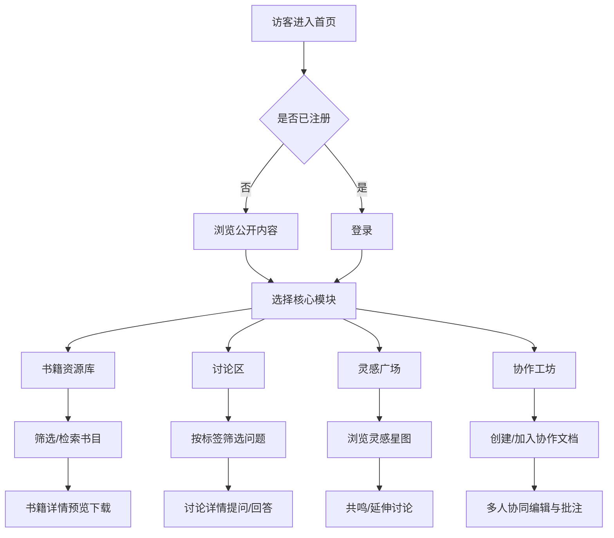

# 天玑 · 产品需求文档（PRD）

## 1. 产品概述

天玑是一个专注于机器学习领域的专业交流论坛，专为数学专业学生群体打造，提供机器学习书籍资源分享、数学与机器学习交叉疑难讨论、创新研究思路交流，以及多人协作教材编写与论文创作工具。其价值在于弥合数学理论与人工智能实践之间的鸿沟，构建一个让单点知识闪光汇聚成完整知识体系的专业社区生态。

- **目标用户**：数学专业本科生及研究生、由数学切入人工智能的学习者、从事数理基础研究的青年学者。
- **核心问题**：数学系学生缺乏从理论走向 AI 实践的系统化资源与同道交流空间；现有社区偏工程实现，缺少数学视角的深度讨论。
- **名称寓意**：天玑为北斗七星之一，象征从单点知识星辰汇聚成完整知识星座体系的愿景。

## 2. 核心功能

### 2.1 用户角色

| 角色 | 注册方式 | 核心权限 |
|------|----------|----------|
| 访客 | 无需注册 | 浏览首页、资源库、讨论与灵感广场的公开内容 |
| 注册成员 | 邮箱注册 | 上述权限 + 发起讨论、回答问题、分享资源、发布灵感、参与协作 |
| 协作者 | 加入协作空间 | 上述权限 + 在线多人协同编辑教材/论文、评论批注 |

### 2.2 功能模块

1. **首页**：平台愿景 Hero、四大核心模块入口导航、精选内容流、社区数据与活跃星辰。
2. **书籍资源库**：机器学习书目的资源分享系统，含分类检索、书卡展示、热度排序与书籍详情。
3. **讨论区**：数学与机器学习交叉领域疑难问题问答板块，含标签筛选、排序、悬赏与回答统计。
4. **灵感广场**：创新想法与研究思路交流空间，以星图卡片形式陈列，支持共鸣与延伸讨论。
5. **协作工坊**：多人协作的教材编写与论文创作工具，含协作文档列表、协同编辑预览与贡献者。
6. **书籍详情**：书目详情、资源预览/下载、相关推荐与读者评价。
7. **讨论详情**：问题正文、公式渲染、回答列表、投票与采纳。

### 2.3 页面详情

| 页面名称 | 模块名称 | 功能描述 |
|----------|----------|----------|
| 首页 | Hero 星辰区 | 平台愿景标题、天玑/北斗星座动效、主副 CTA |
| 首页 | 四象入口 | 四大核心模块卡片导航，悬浮揭示说明 |
| 首页 | 精选内容流 | 横向 tab 切换：最新讨论/热门资源/新灵感 |
| 首页 | 社区星象 | 注册成员、累计资源、解答问题等数据统计 |
| 书籍资源库 | 检索筛选栏 | 关键词搜索 + 分类（基础理论/深度学习/优化/概率统计）筛选 |
| 书籍资源库 | 书卡网格 | 封面、书名、作者、难度、收藏数、标签 |
| 书籍资源库 | 排序控制 | 按热度/最新/难度排序 |
| 书籍详情 | 书目信息 | 封面大图、元信息、简介、目录摘要 |
| 书籍详情 | 资源操作 | 在线预览、下载、收藏、评价星级 |
| 讨论区 | 筛选标签栏 | 按交叉主题标签（线性代数/优化/测度论/信息几何等）筛选 |
| 讨论区 | 问题列表 | 标题、摘要、作者、回答数、浏览数、悬赏值、投票 |
| 讨论区 | 排序控制 | 按最新/热度/悬赏排序 |
| 讨论详情 | 问题正文 | 富文本 + 数学公式渲染、标签、投票 |
| 讨论详情 | 回答列表 | 多条回答、投票、采纳标记、评论 |
| 灵感广场 | 星图陈列 | 灵感卡片以星图网格排布，标题、摘要、作者、共鸣数 |
| 灵感广场 | 筛选排序 | 按主题/共鸣度筛选 |
| 协作工坊 | 文档列表 | 协作文档卡片，标题、类型（教材/论文）、贡献者头像组、进度 |
| 协作工坊 | 编辑预览 | 所见即所得编辑器预览、协同光标、批注侧栏 |
| 协作工坊 | 贡献者面板 | 贡献者列表与编辑权限 |

## 3. 核心流程

**主流程一：访客发现并深入内容**
访客进入首页 → 浏览四大模块入口 → 选择「书籍资源库」 → 通过分类筛选定位书目 → 进入「书籍详情」预览/下载 → 注册后可收藏评价。

**主流程二：学习者求解疑难**
注册成员进入「讨论区」 → 按交叉主题标签筛选 → 阅读问题或发起新问题（含公式） → 进入「讨论详情」查看/撰写回答 → 投票与采纳最佳回答。

**主流程三：协作创作**
注册成员进入「协作工坊」 → 创建或加入协作文档 → 在协同编辑器中实时编写教材/论文 → 批注讨论 → 多人共同完善并发布。

## 4. 界面设计

### 4.1 设计风格

**美学方向：星图学术（Celestial Atlas）**——以天文星图为意象的深沉宇宙学术风。深空夜色为底，星芒金与冷蓝星光为辉，星座连线作为知识汇聚的视觉母题，数学符号隐现于背景。

- **主色**：深空墨蓝（#0a0f2c / #0d1538）渐变近黑为底；星芒暖金（#e9b865 / #f3c969）为主点缀；天玑冷蓝（#7cc4ff / #5aa6f0）为交互辉光。
- **文字**：暖白羊皮纸色（#f1ede2）正文，金色微调白（#fbf3df）标题；次要文字灰蓝（#9aa3c4）。
- **按钮**：主按钮为金边描线 + 微辉光悬浮提升；次按钮为冷蓝描边；圆角克制（6–10px）。
- **字体**：标题用 Fraunces（拉丁）+ Noto Serif SC（中文）彰显学术衬线气质；正文用 Spline Sans（拉丁）+ Noto Sans SC（中文）；数学/代码元数据用 Space Mono。
- **布局**：桌面优先，宽幅留白与星座网格交替，顶部常驻导航；卡片以星点连线串联。
- **图标/装饰**：自定义星点与连线、数学公式水印、星座坐标网格、细微噪点与辉光。

### 4.2 页面设计概览

| 页面名称 | 模块名称 | UI 元素 |
|----------|----------|----------|
| 首页 | Hero 星辰区 | 深空渐变 + 星座连线动效、大字标题 Fraunces、金色 CTA、星点粒子 |
| 首页 | 四象入口 | 四张悬浮卡片，金色描边、悬浮上浮揭示副文案 |
| 首页 | 精选内容流 | 横向 tab、内容卡片左侧星点指示、冷蓝悬浮高亮 |
| 首页 | 社区星象 | 大号数字 + 星芒图标、滚动数字增长动效 |
| 书籍资源库 | 检索筛选栏 | 搜索框 + 标签胶囊筛选、金色选中态 |
| 书籍资源库 | 书卡网格 | 封面阴影、难度星点、悬浮金边、标签胶囊 |
| 书籍详情 | 书目信息 | 左封面右信息双栏、目录折叠、星级评价 |
| 讨论区 | 筛选标签栏 | 交叉主题胶囊、悬赏金色徽标 |
| 讨论区 | 问题列表 | 左投票数列、右侧标题摘要、回答数冷蓝徽标 |
| 讨论详情 | 问题正文 | 公式块高亮、标签、投票箭头 |
| 讨论详情 | 回答列表 | 卡片堆叠、采纳金色描边、评论折叠 |
| 灵感广场 | 星图陈列 | 不规则网格、卡片间虚线连线、共鸣星点动效 |
| 协作工坊 | 文档列表 | 卡片含贡献者头像组、进度条、类型徽标 |
| 协作工坊 | 编辑预览 | 编辑器、协同光标动画、右侧批注侧栏 |

### 4.3 响应式

桌面优先设计（≥1280px 最佳），中等屏（≥768px）栅格自适应收拢，移动端（<768px）单列堆叠、导航折叠为抽屉、星图装饰简化以保性能；触控目标 ≥44px，关闭纯悬浮交互改用点击。

### 4.4 3D 场景指引（可选增强）

- **环境/氛围**：深空星场，远处星云径向辉光，整体沉静学术。
- **光照**：单一冷蓝主光 + 暖金补光，模拟星光双色温。
- **相机**：缓速推进，聚焦星座汇聚节点。
- **构图**：星座连线由远及近点亮，呼应"单点汇聚成体系"。
- **交互动效**：鼠标视差微移、节点呼吸辉光。
- **性能预算**：粒子数受控，移动端降级为 CSS 星点，保持 60fps。
