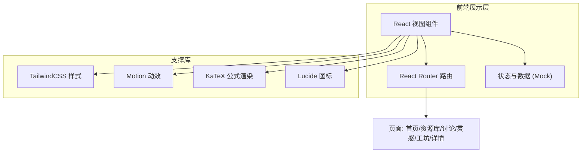
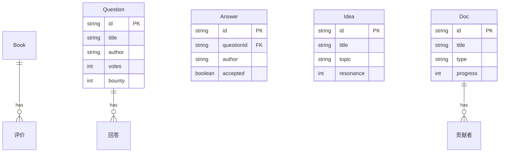

# 天玑 · 技术架构文档

## 1. 架构设计

本项目为纯前端单页应用，采用 Mock 数据模拟社区内容，不依赖后端服务，便于快速呈现完整产品形态。



## 2. 技术说明

- **前端**：React@18 + tailwindcss@3 + vite
- **初始化工具**：vite-init（React + TypeScript 模板）
- **路由**：react-router-dom@6
- **动效**：motion（Framer Motion）用于页面入场、星座连线与微交互
- **公式渲染**：KaTeX（数学与机器学习交叉讨论的公式展示）
- **图标**：lucide-react
- **后端**：无（纯前端 + Mock 数据）
- **数据**：前端内置 Mock 数据集（书籍、问题、灵感、协作文档），模拟论坛内容

## 3. 路由定义

| 路由 | 用途 |
|------|------|
| / | 首页：平台愿景、四模块入口、精选内容流、社区数据 |
| /library | 书籍资源库：分类检索与书卡网格 |
| /library/:id | 书籍详情：书目信息、预览/下载、评价 |
| /discussion | 讨论区：交叉主题问答列表 |
| /discussion/:id | 讨论详情：问题正文、回答列表、投票采纳 |
| /ideas | 灵感广场：研究思路星图陈列 |
| /workshop | 协作工坊：协作文档列表与协同编辑预览 |

## 4. API 定义

无后端，采用前端 Mock 数据模块。关键数据类型定义如下：

```ts
// 书籍资源
interface Book {
  id: string
  title: string
  author: string
  category: '基础理论' | '深度学习' | '优化' | '概率统计'
  difficulty: 1 | 2 | 3 | 4 | 5
  tags: string[]
  cover: string
  summary: string
  favorites: number
  rating: number
}

// 讨论问题
interface Question {
  id: string
  title: string
  excerpt: string
  author: string
  tags: string[]
  answers: number
  views: number
  votes: number
  bounty?: number
  createdAt: string
}

// 灵感
interface Idea {
  id: string
  title: string
  summary: string
  author: string
  topic: string
  resonance: number
  createdAt: string
}

// 协作文档
interface Doc {
  id: string
  title: string
  type: '教材' | '论文'
  contributors: string[]
  progress: number
  updatedAt: string
}
```

## 5. 服务端架构

无后端服务，略。

## 6. 数据模型

前端 Mock 数据集，无持久化数据库。数据按上述类型组织为独立模块导出，供各页面消费。数据关系示意：



## 7. 设计实现要点

- **全局主题**：通过 TailwindCSS 自定义主题色（深空墨蓝、星芒金、天玑冷蓝）与 CSS 变量统一管理；引入 Google Fonts（Fraunces、Noto Serif SC、Spline Sans、Noto Sans SC、Space Mono）。
- **星座母题**：封装可复用的「星座连线」「星点」装饰组件，用于首页 Hero 与灵感广场背景。
- **公式渲染**：在讨论详情页用 KaTeX 渲染数学公式，体现数学与机器学习交叉特色。
- **性能**：星点粒子与连线动效使用 CSS/Motion 轻量实现，移动端降级。
