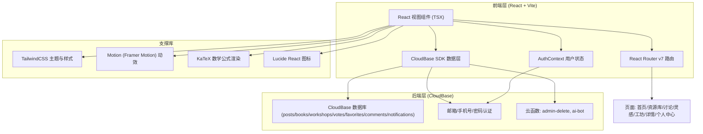

# 天玑 · 技术架构文档

## 1. 架构设计

天玑是一个基于 **React + Vite + TypeScript** 的前端应用，通过 **腾讯云 CloudBase** 提供后端能力（数据库、用户认证、云函数），实现一个真正可用的跨专业 AI 学习与项目共创社区。



## 2. 技术说明

- **前端框架**：React@19 + Vite@7 + TypeScript@6
- **样式方案**：TailwindCSS@3.4，自定义深空主题色（`void-*` 墨蓝、`star-*` 星芒金、`tian-*` 冷蓝），Google Fonts（Fraunces、Noto Serif SC、Spline Sans、Noto Sans SC、Space Mono）
- **路由方案**：React Router v7，支持路由级代码分割（`lazy()` 按需加载）与部署缓存失效自动刷新（`lazyWithReload` 封装）
- **动效**：Motion（Framer Motion 的继任者），用于页面入场、星座连线、卡片悬停、模态弹出等微交互
- **数学公式**：KaTeX（行内 `$...$`、行间 `$$...$$`），在讨论详情页与文档详情页统一渲染
- **图标**：lucide-react
- **后端服务**：CloudBase（腾讯云）
  - **数据库**：posts、books、workshops、votes、favorites、comments、notifications 等集合
  - **用户认证**：邮箱 + 手机号双路径注册/登录（密码验证）
  - **云函数**：`admin-delete`（管理员内容清理）、`ai-bot`（DeepSeek R1 生成 AI 回答和批注）
- **状态管理**：Context API（`AuthContext` 管理登录态）+ 组件内 `useState`，无额外状态库
- **数据持久化**：localStorage（浏览计数去重、已投票记录缓存、用户偏好）
- **打包与部署**：Vite 生产构建 → 部署到 Vercel / CloudBase 静态托管

## 3. 项目结构

```
src/
  components/          # 可复用组件（Modal、Skeleton、BookCard 等）
  pages/               # 路由页面（Home、Library、Discussion、Ideas、Workshop 等）
  stores/              # 全局状态（auth、toast）与 CloudBase 工具函数
  data/                # 静态 Mock 数据（书籍、问题、灵感，作为首屏 fallback）
  App.tsx              # 路由与全局布局
  main.tsx             # 入口
cloudfunctions/
  admin-delete/        # 管理员删除内容云函数
  ai-bot/              # AI 内容生成云函数（DeepSeek R1）
```

## 4. 路由定义

| 路由 | 用途 | 权限 |
|------|------|------|
| / | 首页：平台愿景、四模块入口、精选内容流、社区数据 | 公开 |
| /library | 书籍资源库：分类检索与书卡网格 | 公开 |
| /library/:id | 书籍详情：书目信息、预览/下载、评价 | 公开 |
| /discussion | 讨论区：交叉主题问答列表 + 发帖入口 | 公开浏览，登录可发帖/回答 |
| /discussion/:id | 讨论详情：问题正文、回答列表、投票、采纳、AI 辅助回答 | 公开浏览，登录可互动 |
| /ideas | 灵感广场：研究思路星图陈列，支持新增/编辑 | 公开浏览，登录可发布 |
| /workshop | 协作工坊：协作文档列表与协同编辑预览 | 公开浏览，登录可创建/贡献 |
| /workshop/:id | 工坊详情：文档大纲、正文、贡献历史、AI 批注入口 | 公开浏览，登录可贡献/批注 |
| /profile | 个人中心：昵称/头像管理，我的发帖/回答/贡献/收藏概览 | 登录后 |
| /search | 全局搜索：帖子、书籍、灵感、工坊按关键词检索 | 公开 |

## 5. 数据模型

### posts 集合（讨论帖子）

| 字段 | 类型 | 含义 |
|------|------|------|
| _id | string | CloudBase 文档 ID |
| title | string | 问题标题 |
| body | string | 问题正文（支持 LaTeX） |
| author | string | 作者昵称 |
| authorUid | string | 作者 UID |
| tags | string[] | 标签数组 |
| category | string | 分类（如 '机器学习'、'编程基础'）|
| views | number | 浏览次数（浏览器端去重计数）|
| answerList | Answer[] | 回答列表（内嵌数组，每个回答含 id、author、authorUid、body、votes、accepted、createdAt） |
| createdAt | Date | 创建时间 |
| updatedAt | Date | 最近更新时间 |

### books 集合（书籍资源）

| 字段 | 类型 | 含义 |
|------|------|------|
| title | string | 资源名称 |
| author | string | 作者 / 来源 |
| link | string | 外部链接 |
| category | string | 分类 |
| difficulty | number | 难度（1-5）|
| summary | string | 简介 |
| cover | string | 封面图 URL |
| tags | string[] | 标签 |
| rating | number | 评分（1-5，保留 1 位小数）|
| favoriteCount | number | 收藏数（原子更新）|
| downloads | number | 下载次数（原子更新）|
| fileUrl | string | 文件下载地址 |
| toc | Chapter[] | 章节大纲 |
| reviews | Review[] | 评价列表 |
| authorUid | string | 作者 UID |
| createdAt | Date | 创建时间 |

### workshops 集合（协作文档）

| 字段 | 类型 | 含义 |
|------|------|------|
| title | string | 项目标题 |
| description | string | 项目简介 |
| content | string | 文档正文（支持 LaTeX）|
| outline | Chapter[] | 章节大纲（id、title、brief）|
| contributions | Contribution[] | 贡献历史（章节级，含 id、chapterId、author、authorUid、body、createdAt）|
| author | string | 创建者昵称 |
| authorUid | string | 创建者 UID |
| type | string | 文档类型（'教材'/'论文'/'项目文档'）|
| status | string | 状态（'active'/'completed'）|
| likes | number | 点赞数（原子更新）|
| tags | string[] | 标签 |
| updatedAt | Date | 最近更新时间 |

### votes 集合（回答投票）

| answerId | string | 被投票的回答 ID |
| uid | string | 投票者 UID |
| postId | string | 所属帖子 ID |
| createdAt | Date | 创建时间 |

（设计为独立集合而非 post.answerList.voterUids 数组，利用 CloudBase 文档唯一约束实现防重复投票）

### favorites 集合（书籍收藏）

| bookId | string | 书籍 ID |
| uid | string | 收藏者 UID |
| createdAt | Date | 创建时间 |

### comments 集合（AI 批注）

| workshopId | string | 工坊文档 ID |
| chapterId | string | 章节 ID（可为 'body' 表示全文批注）|
| selectedText | string | 被选中的原文片段 |
| body | string | 批注内容 |
| author | string | 作者昵称 / 'AI 助手' |
| authorUid | string | 作者 UID / 'ai-bot-001' |
| createdAt | Date | 创建时间 |

### notifications 集合（通知）

| 字段 | 类型 | 含义 |
|------|------|------|
| userId | string | 接收者 UID |
| type | string | 'post_approved' / 'comment_reply' 等 |
| title | string | 通知标题 |
| content | string | 通知正文 |
| relatedId | string | 关联内容 ID |
| read | boolean | 是否已读 |
| createdAt | Date | 创建时间 |

## 6. 用户认证与权限

- **认证方式**：邮箱 + 密码 / 手机号 + 密码双路径，通过 CloudBase `auth.signUp` / `auth.signIn` / `auth.signOut` 实现
- **当前用户**：页面挂载时通过 `await auth.getCurUser()` 恢复登录态，写入 `AuthContext`
- **权限策略**：
  - 发帖、回答、贡献、投票、收藏、评价、批注：需登录（`user` 非 null）
  - 采纳回答、删除/编辑自己的回答/帖子：仅限对应 authorUid
  - 管理员功能（删除任意内容）：仅限 `ADMIN_UIDS` 中的账号，操作在 `admin-delete` 云函数中二次校验
  - 未登录用户点击交互按钮触发 `tianji:open-auth` 事件，统一走登录弹窗

## 7. 云函数说明

### admin-delete

管理员清理工具。接收 `itemType`（`post` / `book` / `workshop` / `answer` / `comment` / `idea`）和 `itemId`，在确认调用者属于 `ADMIN_UIDS` 后执行对应删除：

- 删除帖子 → 删除 `post` 文档 + 关联 `votes` 文档
- 删除回答 → 更新帖子的 `answerList`，移除对应回答
- 删除书籍/工坊 → 删除对应文档
- 删除批注/贡献 → 在所属工坊文档中移除对应条目

### ai-bot

内容生成云函数。向 `deepseek-chat`（DeepSeek R1 推理引擎）发送请求，根据 `mode` 参数决定返回格式：

- `mode: 'answer'`：针对一个问题生成 AI 回答，追加到帖子的 `answerList`
- `mode: 'annotation'`：在某章节中追加 AI 批注，用于引导读者思路
- `mode: 'contribute'`：向指定章节贡献内容

请求使用 `{ role: 'system', content: '你是一名严谨的...' }` + 用户问题组合。返回结果作为 `ai-bot-001` 身份写入数据库。

## 8. 设计实现要点

- **全局主题**：通过 TailwindCSS 自定义主题色（深空墨蓝 `void-900/800/700/600/500`、星芒金 `star-500/400/300/200/100`、天玑冷蓝 `tian-400/500/700`、羊皮纸米 `parchment-50/100`、薄雾灰 `mist-300/400/500`），统一通过 CSS 变量管理，便于主题色切换
- **星座母题**：封装可复用的「星座连线」「星点」装饰组件，用于首页 Hero 与灵感广场背景，在移动端降级为静态样式避免性能问题
- **公式渲染**：在讨论详情页、工坊详情页、AI 生成内容中统一用 KaTeX 渲染 `$...$` 和 `$$...$$` 公式，体现数学与机器学习交叉特色
- **懒加载与部署降级**：所有页面路由均使用 `lazy()` 异步加载；自定义 `lazyWithReload` 封装在 chunk 加载失败时刷新页面并失效缓存，便于生产部署滚动更新
- **安全设计**：
  - XSS：用户输入均通过 React 自动转义写入 DOM；富文本渲染采用 KaTeX（公式）+ 换行符替换（纯文本段落）方案，不使用 `dangerouslySetInnerHTML`
  - 管理员操作：所有敏感操作在云函数中二次校验 `ADMIN_UIDS`，不接受前端传入的 UID
  - 输入长度：所有 `<input>` 和 `<textarea>` 均配置 `maxLength`，避免超长文本导致渲染卡顿或数据库文档膨胀
  - 投票/收藏/浏览去重：在前端通过独立的 `votes` / `favorites` 集合 + 会话级缓存实现去重；回答和书籍计数使用 CloudBase `db.command.inc(1)` 原子更新避免并发丢数
- **性能**：星点粒子与连线动效使用 CSS/Motion 轻量实现；图片/封面使用懒加载；搜索与列表分页在未来版本引入
