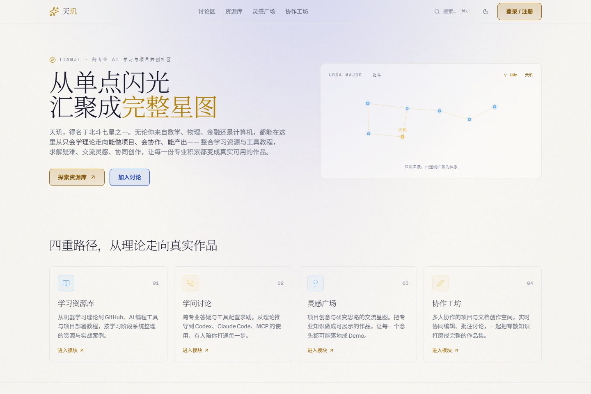
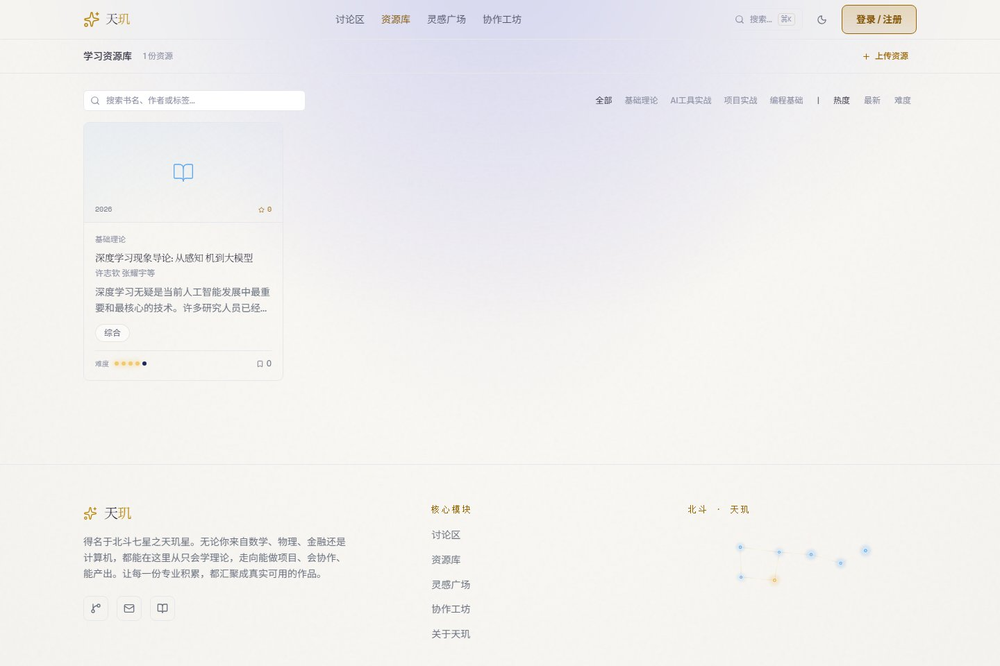
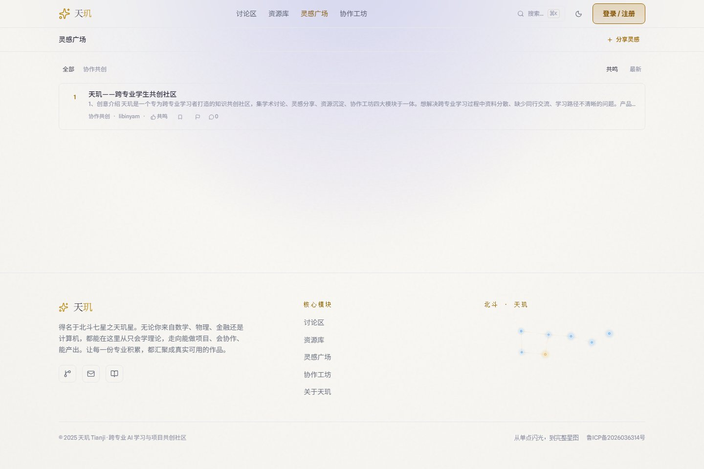
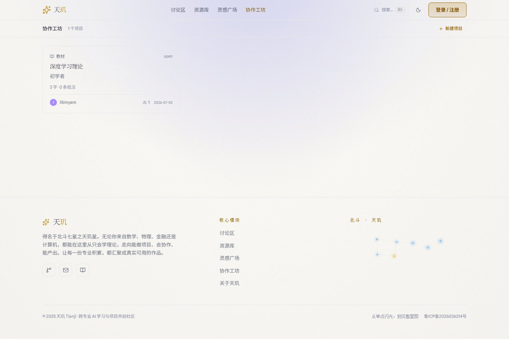
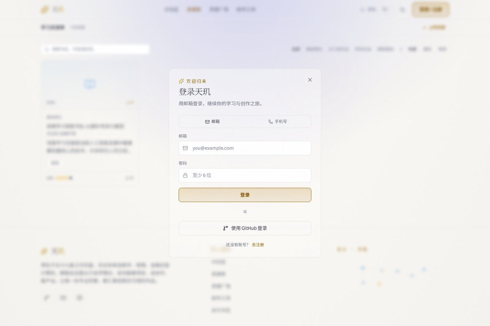

# 天玑 (Tianji) - 跨专业 AI 学习与项目共创社区

[](https://tianjihub.cn)
[](LICENSE)
[](https://www.trae.cn/)

> 从学习资源到项目作品的完整链路：学习 → 答疑 → 灵感 → 协作 → 作品集

## 为什么做这个项目 (Why this exists)

跨专业学生学 AI 工具时普遍面临三个痛点：

1. **资料分散**：教程散落在各平台，不知道该学什么、学到什么程度够用
2. **学完不会做**：看了一堆教程，但不知道怎么把专业知识变成一个真实项目
3. **孤军奋战**：想找同方向的人协作，却只能在微信群里零散发问

天玑不是另一个"教程站"或"问答论坛"，而是把**学习资源、讨论答疑、灵感沉淀、协作工坊、作品集**串成一条完整路径——一个普通学生从"不会"开始，最终能产出可展示的作品。

## Built with Trae — AI 协作开发故事

天玑是 [TRAE AI 创造力大赛](https://forum.trae.cn/t/topic/70094) 参赛项目，全程与 Trae 结对开发。人提出方向与判断，Trae 辅助拆解与实现，形成"人机共创"的工作流。

| 阶段 | 人做什么 | Trae 做什么 |
|------|---------|------------|
| **1. 项目初始化** | 定位"跨专业学习社区"，规划四个核心模块 | 生成 Vite + React + TS 脚手架，搭建路由与 CloudBase 接入 |
| **2. 多模块并行** | 定义数据模型、设计 UI 草图 | 生成讨论区/资源库/灵感广场/协作工坊组件，实现 CRUD 与标签体系 |
| **3. AI 集成** | 决定接入 DeepSeek 做自动答疑 | 生成 ai-bot 云函数，实现幂等防重复、限流、内容审核前置 |
| **4. 性能优化** | 发现首屏慢、黑屏 MIME 错误 | 定位 vercel.json headers 规则过宽，修复 chunk 分割与懒加载 |
| **5. 部署稳定性** | 要求 ICP 备案 + 自定义域名 | 生成 CI/CD 流水线，配置安全规则、分支保护、依赖审计 |

**典型协作模式**：Issue 驱动开发——人发现问题提 issue，Trae 拆解实现方案并生成代码，人 review 后合并。至今已通过这种方式关闭 100+ issue。

## Status & What's Live

天玑已上线运行，以下能力均可访问 [tianjihub.cn](https://tianjihub.cn) 体验：

| 模块 | 已上线能力 |
|------|-----------|
| **讨论区** | 学术区/闲聊区分区、发帖、回答、评论、投票、采纳、AI 自动回复、相关帖推荐 |
| **灵感广场** | 灵感发布、共鸣互动、标签聚合 |
| **资源库** | PDF/书籍上传、目录自动识别、在线预览、下载、编辑/删除 |
| **协作工坊** | 多人协作文档、章节大纲、批注讨论 |
| **关注体系** | 关注用户、关注标签、个性化 Feed |
| **UGC 安全** | 腾讯云数据万象文本审核、敏感词兜底、moderation_logs 审计 |
| **AI 答疑** | DeepSeek 驱动的 ai-bot，发帖自动回复 + 相关帖链接推荐 |
| **管理后台** | 帖子管理、举报处理、用户封禁 |
| **SEO 基础** | 动态 meta + OG tags + JSON-LD 结构化数据 |
| **工程规范** | CI/CD（lint + tsc + test + audit）、分支保护、CODEOWNERS |
| **版本** | v0.3.0 已发布 |

ICP 备案已完成，自定义域名 `tianjihub.cn` 正式运行。

## 界面预览

| 产品概览 | 资源库 |
| --- | --- |
|  |  |

| 灵感广场 | 协作工坊 |
| --- | --- |
|  |  |

| 登录与行动入口 |
| --- |
|  |

> demo GIF 录制中，将在比赛提交前替换静态截图。

## 技术栈

- **React 19** + TypeScript
- **Vite 8** 构建工具
- **Tailwind CSS** 样式
- **Zustand** 状态管理
- **CloudBase**（腾讯云开发）后端服务
- **React Router 7** 路由
- **KaTeX** 数学公式渲染（按需懒加载）
- **PDF.js** 目录自动识别
- **Motion** 动画
- **DeepSeek** AI 答疑
- **腾讯云数据万象 (CI)** UGC 文本审核

## 功能模块

### 核心功能

- **讨论区**：学术区与闲聊区分区运营，学术区支持标签筛选，闲聊区按子分类（灌水/动态/新闻/其他）浏览
- **问答系统**：发帖、回答、评论、投票、采纳回答（可取消采纳）、AI 机器人自动回复 + 相关帖推荐
- **灵感广场**：快速分享灵感，共鸣互动
- **资源库**：书籍上传与下载，PDF 上传自动识别目录书签，支持在线预览与下载
- **协作工坊**：多人协作编辑文档，批注讨论，章节大纲管理，创建者可编辑标题/简介/删除项目

### 跨模块联动

- **标签体系**：讨论、灵感、资源、协作共享标签，基于标签自动推荐相关内容
- **全局搜索 + 热度榜**：跨模块搜索，热门标签导航
- **标签详情页**：按标签聚合四个模块的内容

### 社区功能

- **用户认证**：邮箱注册登录、GitHub OAuth
- **关注体系**：关注用户、关注标签、个性化 Feed
- **消息通知**：回答、采纳、评论、关注等事件通知
- **收藏功能**：收藏帖子、资源等，支持取消收藏
- **个人主页**：展示用户发布的内容与收藏
- **管理后台**：帖子管理、举报处理
- **举报系统**：举报违规内容

### 体验与无障碍

- **深色 / 浅色主题切换**（默认浅色）
- **无障碍弹窗**：共享 Dialog 组件，焦点陷阱、ESC 关闭、焦点恢复、滚动锁定
- **减弱动画**：支持 `prefers-reduced-motion`，自动禁用装饰动画
- **键盘可访问的标签选择器**：combobox 语义，↑↓ 导航，Enter 选择，Escape 关闭
- **移动端优化**：StarField 移动端降级，路由懒加载

## 本地启动

```bash
npm install
npm run dev
```

需要配置环境变量。复制 `.env.example` 为 `.env` 并填入实际值（`.env` 已被 `.gitignore` 忽略，不会提交到仓库）：

```bash
cp .env.example .env
```

```env
VITE_CLOUDBASE_ENV_ID=你的云环境ID
VITE_CLOUDBASE_REGION=你的地域
VITE_CLOUDBASE_ACCESS_KEY=你的访问密钥
```

## 部署

### Vercel 部署

项目已配置 `vercel.json`，支持 Vercel 自动部署。推送代码到 `main` 分支后 Vercel 自动构建部署。

配置要点：
- `/assets/*` 静态资源使用 immutable 长缓存
- HTML 使用 `no-cache` 确保每次获取最新版本
- 旧 hash 资源返回 404 而非重写到 index.html（避免 CSS MIME 类型错误）
- 安全响应头：`X-Content-Type-Options`、`Content-Security-Policy: frame-ancestors 'none'`、`Referrer-Policy`

### CloudBase 静态托管

也可部署到 CloudBase 静态托管，需配置环境变量后构建：

```bash
npm run build
```

将 `dist/` 目录上传至 CloudBase 静态托管。

### 云函数部署

`cloudfunctions/` 目录下的云函数需要通过 CloudBase CLI 单独部署：

```bash
# 安装 CloudBase CLI
npm install -g @cloudbase/cli

# 登录并选择环境
tcb login

# 部署 ai-bot 云函数（AI 自动回复）
tcb fn deploy ai-bot --envId <你的云环境ID>

# 部署 admin-delete 云函数（管理员删除帖子）
tcb fn deploy admin-delete --envId <你的云环境ID>

# 部署 db-backup 云函数（数据库定时备份）
tcb fn deploy db-backup --envId <你的云环境ID>
```

部署后需在云函数环境变量中配置：

```bash
# AI 机器人需要 DeepSeek API 密钥
tcb fn config set DEEPSEEK_API_KEY <你的密钥> --name ai-bot --envId <你的云环境ID>
```

### 数据库安全规则部署

`cloudbase-security-rules.json` 定义了所有集合的安全规则（谁可以读/写/改/删）。修改规则后需重新部署：

```bash
# 预览将要应用的规则（不实际执行）
npm run deploy:rules:dry

# 应用规则到 CloudBase 环境
# 需设置 TCB_SECRET_ID 和 TCB_SECRET_KEY 环境变量（管理端密钥，非前端 accessKey）
npm run deploy:rules
```

验证规则已生效：

```bash
# 用未登录状态直接调用 db.collection('posts').add() 应返回 DATABASE_PERMISSION_DENIED
# 用登录用户尝试删除他人帖子应返回权限拒绝
```

各集合规则概要：

| 集合 | 权限模型 |
|------|---------|
| posts/ideas | 作者(authorUid)或管理员可改删 |
| books | 上传者(uploaderUid)或管理员可改删 |
| workshops | 创建者(creatorUid)或管理员可改删 |
| votes/favorites | 用户只能改删自己的记录 |
| notifications | 用户只能读改删自己的通知 |
| reports | 用户可举报，仅管理员可处理 |
| tags/announcements | 前端只读 |
| sys_* | PRIVATE 禁止前端访问 |

## 目录结构

```
.
├── src/
│   ├── components/   # 通用组件（Dialog、TagSelector、StarField 等）
│   ├── pages/        # 路由页面
│   ├── lib/          # CloudBase 封装与业务逻辑
│   ├── stores/       # Zustand 状态管理
│   ├── types/        # TypeScript 类型定义
│   └── data/         # 静态数据与种子内容
├── cloudfunctions/   # 云函数（ai-bot、admin-delete、content-moderation 等）
├── public/           # 静态资源
└── vercel.json       # Vercel 部署配置
```

## 性能优化

- **路由懒加载**：所有页面级组件使用 `React.lazy` 动态导入
- **KaTeX 懒加载**：数学公式渲染库按需加载，不阻塞首页
- **PDF.js 懒加载**：仅在上传 PDF 文件时加载解析器
- **代码分割**：React、Motion、CloudBase SDK、KaTeX 独立 chunk
- **生产构建优化**：移除 Trae inspector 元数据，不泄露源码路径
- **StarField 降级**：移动端减少星星数量，浅色模式不渲染

## License

MIT

## 隐私政策

详见 [PRIVACY.md](PRIVACY.md)，说明我们如何收集、处理和保护您的个人信息（PIPL 合规）。
